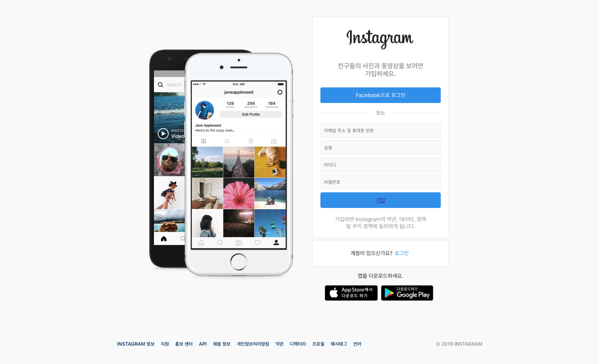
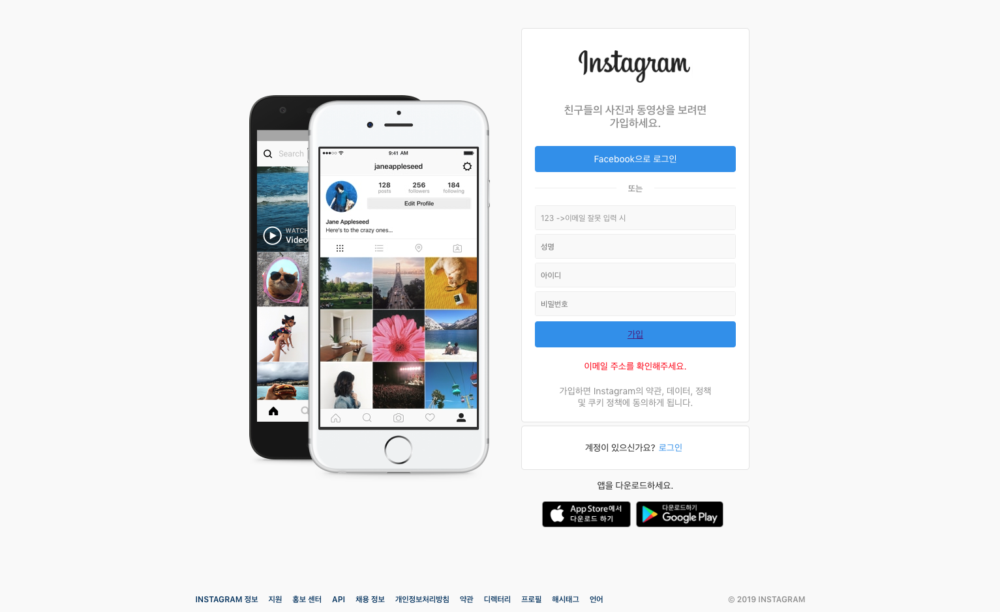
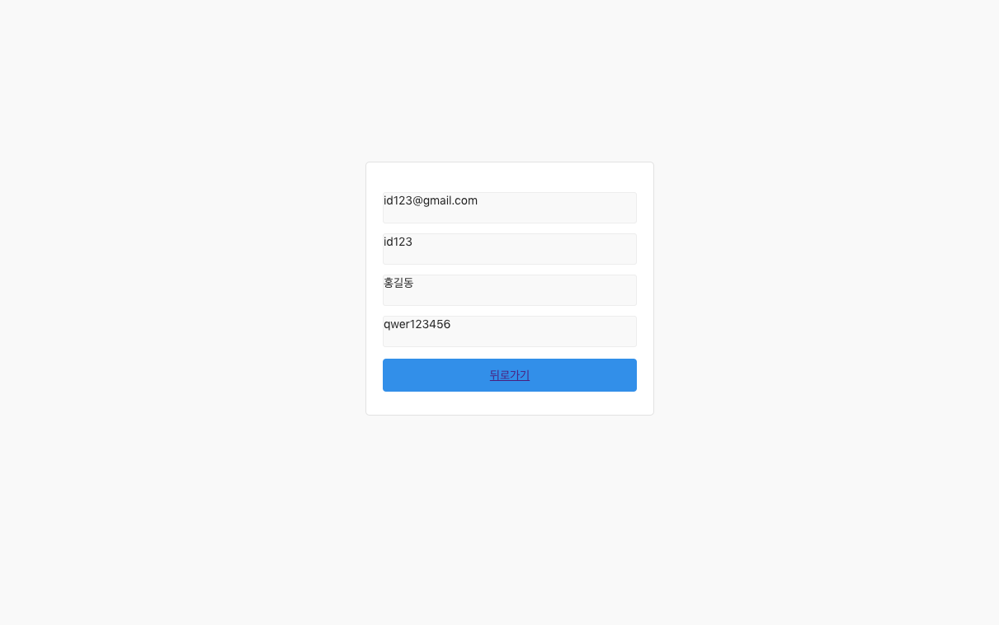

# REACT_INSTAGRAM
REACTJS공부를 위한 INSTAGRAM 메인화면 구현
***
# 개요
>javascript는 어느 순간부터 프레임워크 및 라이브러리의 홍수 속에 있는 듯합니다.

어느 네이버 개발자가 한 말이다. 나도 위의 문구에 크게 공감한다. 그 중에서도 3대장이라 불리우는 **Vue.js, Augular.js, React.js**는 혁신을 불러 일으키고 있다. 이 최신 동향에 발 맞추어 나 또한 3대장 중 **React.js를 공부**하기 위해 숙주인 페이스북에 대표 SNS인 인스타그램에 메인화면과 로그인 정보 값을 새로운 화면에 넘기는 작업을 해보았다.

***

# 기획

* **Instagram 메인화면**을 참고하여 개발자 코드를 보지 않고 react로 컴포넌트구성 등에 기획을 하고 JSX문법과 CSS로 화면을 구현한다.
* **react를 풍부하게 해주는 라이브러리**인 redux 라이브러리를 이용하여 데이터를 관리하고 화면을 이동할 시 router를 이용한다.
* **Input 창**에는 이메일, 성명, 아이디, 비밀번호로 구성하고 가입 버튼을 클릭할 경우 조건에 맞으면 다음 페이지로 넘어가 해당 정보를 보여준다.
* **구현 시 필요한 resources**는 해당 페이지 개발자 창에서 받아와 쓴다.

***

# 구현 이미지

### Main  

### 조건에 만족을 못할 시  

### NextPage  

***

# 사용 라이브러리

* *create-react-app* 폴더명

* *npm(node) 사용*

* *react-router : npm react-router-dom* react에서 페이지를 이동할 때 유용한 라이브러리 
  **참고자료링크 : https://github.com/ReactTraining/react-router** 
* *redux : npm redux, npm react-redux, npm immutable* 
  **참고자료링크 : https://github.com/reduxjs/redux** 
  앞에 2개의 라이브러리는 리덕스에서 제공하는 함수를 활용하기 위한 설치, immutable은 자료형 데이터를 효율적으로 관리하기 위한 설치
